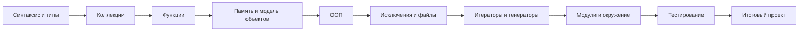

# Программирование на Python

Учебный репозиторий дисциплины с лекциями, лабораторными, силлабусом, дополнительными материалами и критериями оценивания.

## Навигация

| Раздел | Содержание |
|---|---|
| [Силлабус](syllabus/course.md) | цели, результаты, правила |
| [Календарь](syllabus/schedule.md) | 10 учебных модулей |
| [Лекции](lectures/README.md) | конспекты по основным темам Python |
| [Лабораторные](labs/README.md) | практические задания |
| [Материалы](materials/README.md) | шпаргалки, данные, ссылки |
| [Оценивание](assessment/README.md) | формула оценки и рубрики |

## Логика курса

> [!TIP]
> Репозиторий специально построен так, чтобы Markdown был не только носителем текста, но и интерфейсом курса: в нем находятся данные, схемы, тест-кейсы, чек-листы и навигация.
