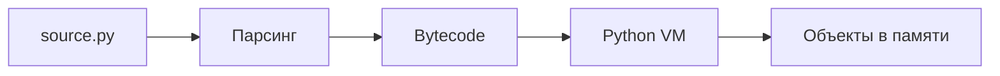

# Лекция 1. Python как язык и среда выполнения

## Ключевая мысль

> [!NOTE]
> Python-код работает с объектами; имена связываются с объектами во время выполнения.

## Минимальная модель



## Типы

```python
x = 10          # int
rate = 0.15     # float
name = "Ada"    # str
active = True   # bool
```

Тип принадлежит объекту, а не имени `x`.

## Самопроверка

<details>
<summary>Может ли имя x сначала ссылаться на int, а потом на str?</summary>

Да. Динамическая типизация означает, что тип проверяется у текущего объекта во время выполнения.

</details>
