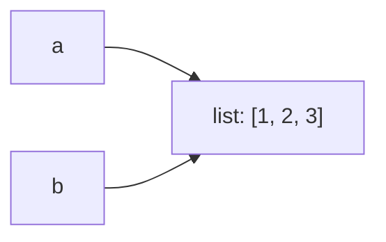

# Лекция 4. Объекты, ссылки и память

## Имена и объекты

```python
a = [1, 2]
b = a
b.append(3)
print(a)  # [1, 2, 3]
```



`a` и `b` ссылаются на один объект.

## Изменяемость

```python
x = 10
x += 1
```

Для `int` создается новый объект. Для изменяемых коллекций операция может менять существующий объект.

## Сборка мусора

В CPython основным механизмом освобождения объектов является подсчет ссылок; циклические ссылки дополнительно обрабатываются циклическим GC.

<details>
<summary>Почему это важно разработчику?</summary>

Чтобы понимать побочные эффекты, копирование, жизненный цикл ресурсов и причины некоторых утечек памяти.

</details>
