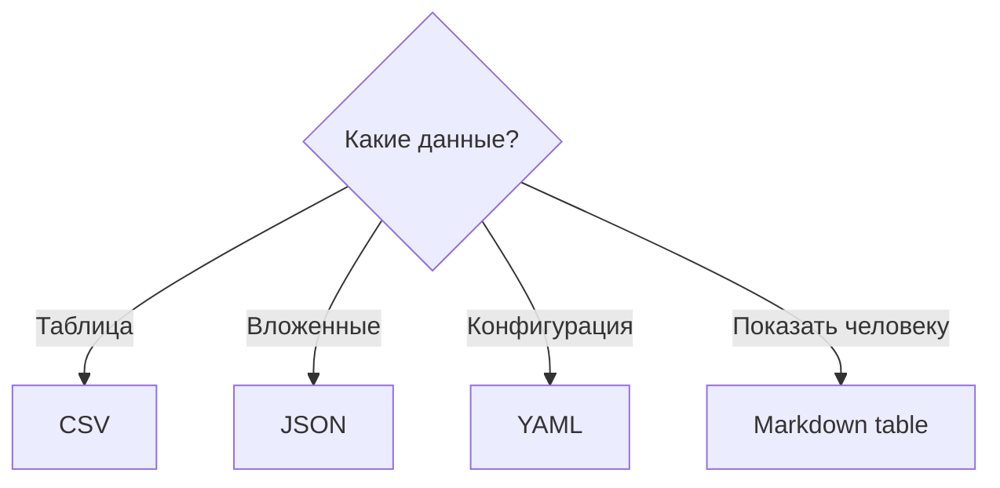

# Форматы данных в учебных заданиях

Markdown позволяет положить маленький набор данных **непосредственно в условие**.

## CSV

```csv
id,name,score
1,Alice,89
2,Bob,73
```

## JSON

```json
{"id": 1, "name": "Alice", "score": 89}
```

## YAML

```yaml
course: Python
semester: 1
labs: 5
```

## Когда что использовать

| Формат | Подходит для |
|---|---|
| CSV | табличных данных |
| JSON | вложенных структур и API |
| YAML | конфигураций и метаданных |
| Markdown table | визуального сравнения |


