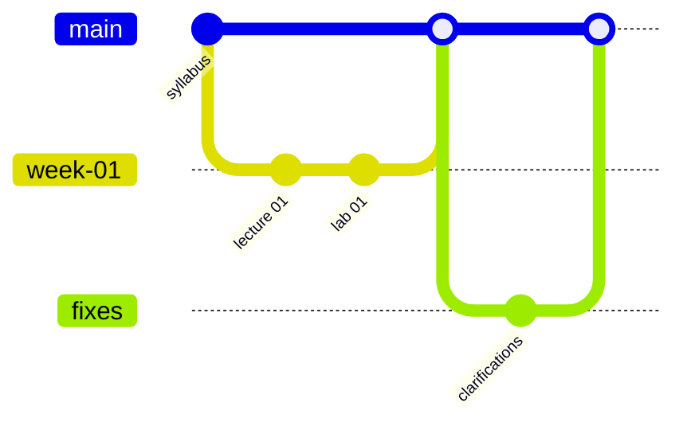

# Как устроен этот репозиторий

## Почему Markdown

Markdown:

- хорошо diff-ится в Git;
- легко рецензируется в Pull Request;
- поддерживает код с подсветкой синтаксиса;
- позволяет строить Mermaid-схемы;
- хранит небольшие CSV/JSON/YAML-данные прямо рядом с условием;
- поддерживает checklist и collapsible-блоки;
- легко преобразуется в статический учебный сайт.

## Рекомендуемая работа преподавателя

